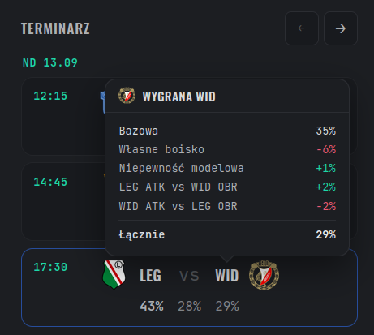

# esa-model-core

A source-only reference implementation of the forecasting machinery behind a personal Ekstraklasa model. The distribution is named `esa-model-core`; Python imports remain under `esa_model`.

This repository contains algorithms, type contracts, synthetic tests, and adapted technical documentation. It deliberately contains **no match datasets, fitted team-state snapshots, generated fit artifacts or forecast data files, diagnostics, experiment logs, deployment code, or original Git history**. Source modules do retain selected numeric defaults and policy constants used by the algorithms. It is therefore a reference implementation, not a ready-made reproduction of the private operational forecast.



*Example from the companion frontend, which is not included in this repository.*

## Quick start

Python 3.14 and [uv](https://docs.astral.sh/uv/) are required.

```console
uv sync
uv run pytest
uv run python examples/synthetic_season.py
uv run python examples/worked_match.py
```

The optional C extension accelerates motivation simulations. Installation continues with the Python implementation if a compiler is unavailable.

## What callers provide

The exported code does not contain fitted team state or a complete model assembly. Callers construct model globals, priors, fixtures, optional xG observations, Cup context, and most policy inputs themselves. Reusable CSV parsing remains for caller-owned match and covariate data, but private research CLIs, diagnostic assembly, and operational data preparation are not exported. The source boundary document identifies the selected constants and canonical derby IDs that remain embedded.

Public or synthetic season simulations must pass an explicit relocation policy. Use `RelocatedHomeHfaPolicy(())` to state that no fixtures are relocated. Omitting the argument retains the private application's operational default and expects its non-exported policy CSV.

## Documentation

Read the [model documentation and API guide](https://adrunkhuman.github.io/esa-model-core/).

To preview the documentation locally:

```console
uv sync --locked --only-group docs --no-install-project
uv run --no-sync mkdocs serve
```
